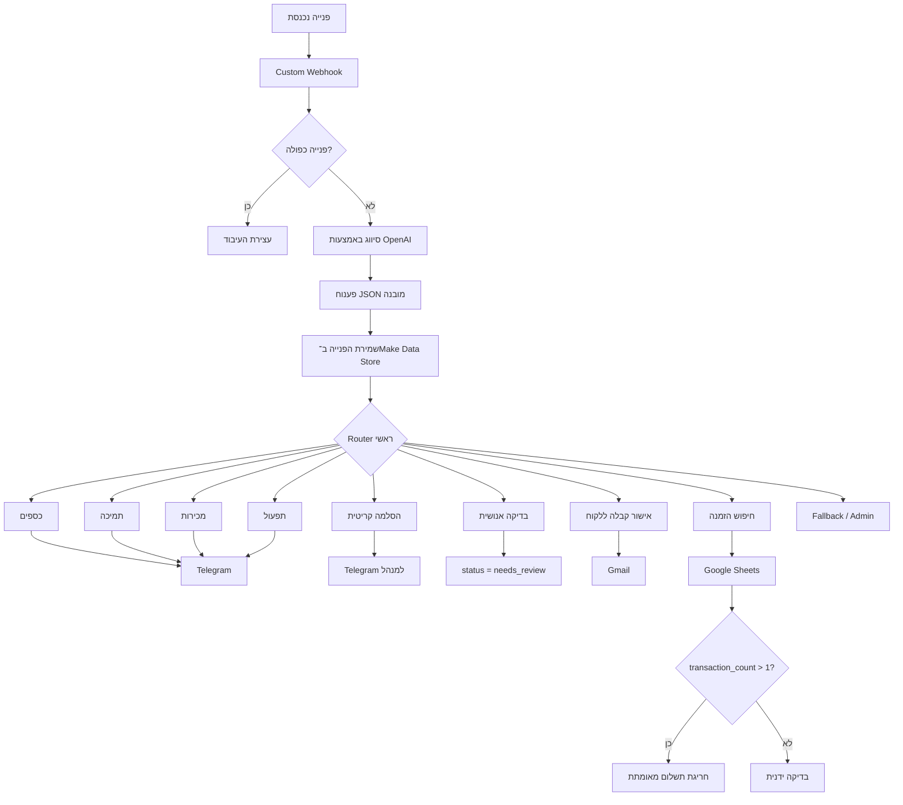

# תיבת תפעול חכמה — אוטומציית Make

Workflow לניהול פניות עסקיות המבוסס על AI ונבנה ב־Make. המערכת מקבלת פניות, מסווגת אותן באמצעות OpenAI, מנתבת אותן לצוות המתאים, מאמתת נתוני הזמנות, מסלימה מקרים מסוכנים ומשאירה אדם בתהליך כאשר נדרש שיקול דעת אנושי.


## למה בניתי את הפרויקט

צוותי תמיכה ותפעול מקבלים לעיתים פניות מכמה ערוצים ועדיין תלויים באדם שיקרא כל הודעה, יבין את הבעיה, יחליט מי אחראי לטפל בה, יבדוק את ההזמנה הרלוונטית ויעדכן את הצוות המתאים.

בניתי את הפרויקט כדי להפוך את שכבת התפעול הראשונית הזאת לאוטומטית, תוך השארת הכללים העסקיים מחוץ ל־LLM וחיוב בדיקה אנושית עבור פעולות רגישות.

## מה האוטומציה עושה

1. מקבלת פנייה דרך Custom Webhook.
2. בודקת את מזהה הפנייה מול Make Data Store כדי למנוע עיבוד כפול.
3. שולחת פניות חדשות ל־OpenAI לצורך סיווג מובנה וחילוץ מידע.
4. מפרקת את התגובה המובנית לשדות שבהם Make יכול להשתמש ב־Filters וב־Routes.
5. שומרת את הפנייה יחד עם Metadata תפעולי וסטטוס.
6. מנתבת את הפנייה למחלקת כספים, תמיכה, מכירות או תפעול.
7. שולחת התראות Telegram לצוות המתאים.
8. מסלימה למנהל מקרים קריטיים או חשודים הקשורים לתשלום.
9. מסמנת מקרים רגישים כ־`needs_review` לצורך טיפול אנושי.
10. שולחת ללקוח הודעת אישור קבלה דרך Gmail.
11. מחפשת את מספר ההזמנה שחולץ בתוך Google Sheets.
12. מאמתת חריגות תשלום מול נתוני ההזמנה במקום להסתמך רק על תוכן ההודעה.

## ארכיטקטורה



## פלט AI מובנה

המודל מחזיר תגובה מובנית וקפדנית במקום טקסט חופשי.

```json
{
  "department": "finance",
  "category": "duplicate_charge",
  "priority": "high",
  "intent": "request_refund",
  "sentiment": "negative",
  "order_number": "14256",
  "summary": "הלקוח מדווח שחויב פעמיים עבור הזמנה 14256.",
  "requires_human": true,
  "recommended_action": "יש לאמת את החיוב הכפול לפני כל פעולה של החזר כספי.",
  "confidence": 0.99
}
```

ה־LLM משמש להבנת הפנייה. Make אחראי על ניתוב, הסלמה, שמירת נתונים, מניעת כפילויות ולוגיקת אישורים.

## כללים עסקיים

- פניות כפולות נעצרות לפני הקריאה ל־OpenAI כדי למנוע עיבוד ועלות מיותרים.
- פניות מנותבות לפי מחלקה באמצעות Filters דטרמיניסטיים ב־Make.
- החזרים כספיים, תשלומים חשודים, שינויים שמשפיעים על חשבון ומקרים עמומים עשויים לחייב בדיקה אנושית.
- פניות קריטיות עוברות הסלמה למנהל.
- קטגוריות של תשלום חשוד יכולות להפעיל הסלמה גם כאשר המודל מחזיר `high` ולא `critical`.
- הודעת לקוח לעולם אינה מפעילה אוטומטית החזר כספי או פעולה פיננסית בלתי הפיכה אחרת.
- טענות הקשורות להזמנה נבדקות מול מקור נתונים עסקי נפרד לפני שהן נחשבות מאומתות.

## אימות הזמנות

מקור נתוני ההזמנות הוא Google Sheet המשמש כ־Database קל משקל לצורכי ההדגמה.


דוגמה ללוגיקה:

```text
transaction_count > 1
=> חריגת תשלום מאומתת
=> התראה לכספים + בדיקה אנושית

transaction_count <= 1
=> אין חריגת תשלום מאומתת
=> בדיקה ידנית
```

כך האימות העובדתי נשאר נפרד מפרשנות ה־AI.

## אינטגרציות

| כלי | מטרה |
|---|---|
| Make | Orchestration של ה־Workflow, Routers, Filters ולוגיקה עסקית |
| OpenAI | סיווג, חילוץ מידע, סיכום וחישוב Confidence |
| Make Data Store | שמירת פניות ומניעת כפילויות |
| Google Sheets | חיפוש הזמנות ונתוני אימות תשלום |
| Telegram Bot | התראות למחלקות והסלמה למנהל |
| Gmail | הודעות אישור קבלה ללקוח |
| Custom Webhook | נקודת הכניסה לפניות חיצוניות |

## דוגמה לפנייה

```json
{
  "request_id": "REQ-1025",
  "source": "website",
  "customer_name": "David Cohen",
  "email": "david@example.com",
  "subject": "חיוב כפול",
  "message": "חויבתי פעמיים עבור הזמנה 14256 ואני רוצה החזר כספי.",
  "received_at": "2026-09-13T23:10:00+03:00"
}
```

התנהגות צפויה:

```text
Route של כספים
+ Route לבדיקה אנושית
+ אישור קבלה ללקוח
+ חיפוש הזמנה
+ התראת חריגה מאומתת כאשר transaction_count > 1
```

## מבנה ה־Repository

```text
.
├── README.md
├── docs/
│   ├── architecture.md
│   ├── business-rules.md
│   └── test-cases.md
├── make/
│   ├── README.md
│   └── scenario-blueprint.json
├── prompts/
│   └── request-classification.md
├── sample-data/
│   └── orders.csv
└── screenshots/
    ├── full-scenario.png
    └── orders-database.png
```

## החלטות תכנון

### הלוגיקה העסקית נשארת מחוץ ל־LLM
OpenAI מפרש את הפנייה, בעוד Make מחליט אילו פעולות מותרות. כך ה־Flow קל יותר לביקורת ובטוח יותר לשינויים.

### מניעת כפילויות מתבצעת לפני עיבוד AI
שליחות Webhook חוזרות אינן יוצרות Tickets כפולים ואינן גורמות לקריאות Model מיותרות.

### Human-in-the-loop בפעולות רגישות
המערכת יכולה לסווג, לאמת ולהמליץ, אך היא אינה מבצעת אוטומטית החזרים כספיים או פעולות אחרות בעלות השפעה גבוהה.

### טענות מאומתות מול נתונים עסקיים
בבעיות הקשורות להזמנה, ה־Workflow בודק מקור הזמנות חיצוני לפני שהוא מתייחס לטענה כמאומתת.

## היקף נוכחי

זהו יישום עובד לתיק עבודות המתמקד בקליטת פניות, סיווג AI, ניתוב, שמירת נתונים, הסלמה, תקשורת עם הלקוח ואימות הזמנות.

שיפורים מוכווני Production שהייתי מוסיף בהמשך כוללים Audit Logging מרכזי, ניטור SLA, מנגנוני Retry ו־Error Handling, תהליכי אישור, חיבור למערכת Tickets או CRM אמיתית ו־Dashboards תפעוליים.

## הערות

- נתוני הלקוחות וההזמנות לדוגמה הם סינתטיים.
- ה־Workflow בנוי בגישת Make-first ואינו תלוי ב־Backend מותאם אישית.