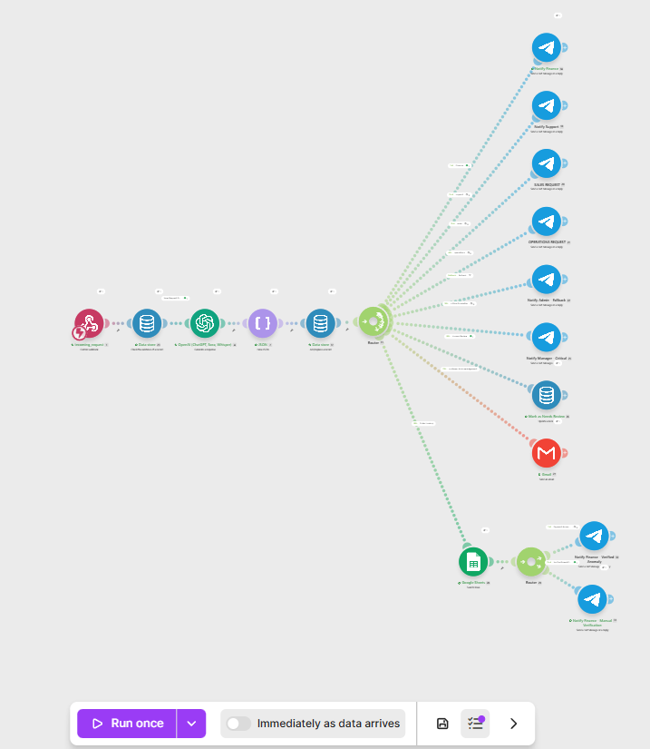
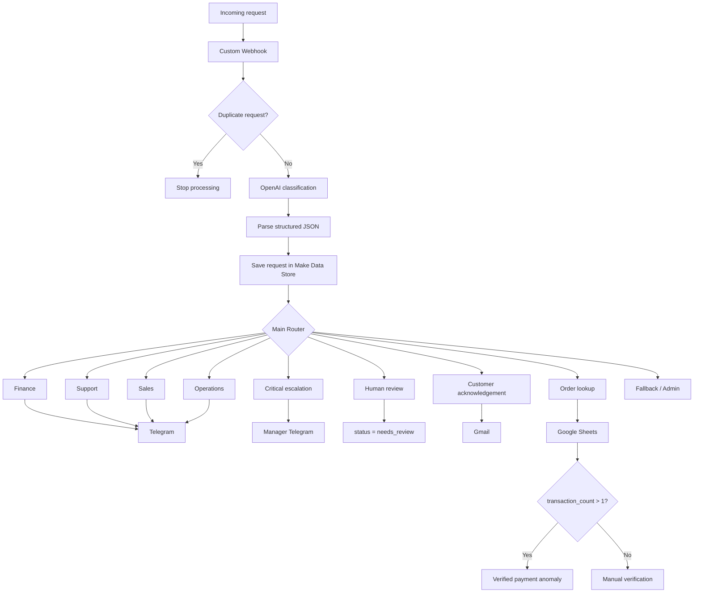
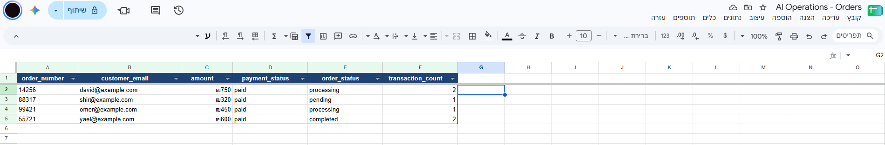

# AI Operations Inbox — Make Automation

AI-powered request management workflow built in Make that receives business requests, classifies them with OpenAI, routes them to the right team, verifies order data, escalates risky cases, and keeps a human in the loop when needed.



## Why I built it

Support and operations teams often receive requests from several channels and still rely on a person to read every message, understand the issue, decide who owns it, check the related order, and notify the right team.

I built this project to automate that first operational layer while keeping business rules outside the LLM and requiring human review for sensitive actions.

## What the automation does

1. Receives a request through a custom webhook.
2. Checks the request ID against a Make Data Store to prevent duplicate processing.
3. Sends new requests to OpenAI for structured classification and extraction.
4. Parses the structured response into fields Make can use in filters and routes.
5. Stores the request with operational metadata and status.
6. Routes the request to Finance, Support, Sales, or Operations.
7. Sends Telegram alerts to the relevant team.
8. Escalates critical or suspicious payment cases to a manager.
9. Marks sensitive cases as `needs_review` for human handling.
10. Sends an acknowledgement email to the customer through Gmail.
11. Looks up the extracted order number in Google Sheets.
12. Verifies payment anomalies against order data instead of trusting the message alone.

## Architecture



## Structured AI output

The model returns a strict structured response instead of free-form text.

```json
{
  "department": "finance",
  "category": "duplicate_charge",
  "priority": "high",
  "intent": "request_refund",
  "sentiment": "negative",
  "order_number": "14256",
  "summary": "Customer reports being charged twice for order 14256.",
  "requires_human": true,
  "recommended_action": "Verify the duplicate charge before any refund action.",
  "confidence": 0.99
}
```

The LLM is used to understand the request. Make is responsible for routing, escalation, persistence, duplicate handling, and approval logic.

## Business rules

- Duplicate requests are stopped before the OpenAI call to avoid unnecessary processing and cost.
- Requests are routed by department using deterministic Make filters.
- Refunds, suspicious payments, account-impacting changes, and ambiguous cases can require human review.
- Critical requests are escalated to a manager.
- Suspicious payment categories can also trigger escalation even when the model returns `high` rather than `critical`.
- A customer message never triggers an automatic refund or other irreversible financial action.
- Order claims are checked against a separate business-data source before being treated as verified.

## Order verification

The order data source is a Google Sheet used as a lightweight demo database.



Example logic:

```text
transaction_count > 1
=> Verified Payment Anomaly
=> Finance alert + human review

transaction_count <= 1
=> No Confirmed Payment Anomaly
=> Manual verification
```

This keeps factual verification separate from AI interpretation.

## Integrations

| Tool | Purpose |
|---|---|
| Make | Workflow orchestration, routers, filters and business logic |
| OpenAI | Classification, extraction, summarization and confidence scoring |
| Make Data Store | Request persistence and duplicate prevention |
| Google Sheets | Order lookup and payment-verification data |
| Telegram Bot | Department notifications and manager escalation |
| Gmail | Customer acknowledgement emails |
| Custom Webhook | Entry point for external requests |

## Example request

```json
{
  "request_id": "REQ-1025",
  "source": "website",
  "customer_name": "David Cohen",
  "email": "david@example.com",
  "subject": "Duplicate charge",
  "message": "I was charged twice for order 14256 and I want a refund.",
  "received_at": "2026-09-13T23:10:00+03:00"
}
```

Expected behavior:

```text
Finance route
+ Human Review route
+ Customer acknowledgement
+ Order lookup
+ Verified anomaly alert when transaction_count > 1
```

## Repository structure

```text
.
├── README.md
├── docs/
│   ├── architecture.md
│   ├── business-rules.md
│   └── test-cases.md
├── make/
│   ├── README.md
│   └── scenario-blueprint.json
├── prompts/
│   └── request-classification.md
├── sample-data/
│   └── orders.csv
└── screenshots/
    ├── full-scenario.png
    └── orders-database.png
```

## Design decisions

### Business logic stays outside the LLM
OpenAI interprets the request, while Make decides what actions are allowed. This keeps the flow easier to audit and safer to change.

### Duplicate prevention runs before AI processing
Repeated webhook deliveries do not create duplicate tickets or unnecessary model calls.

### Human-in-the-loop for sensitive actions
The system can classify, verify and recommend, but it does not automatically perform refunds or other high-impact actions.

### Claims are verified against business data
For order-related issues, the workflow checks an external order source before treating the claim as confirmed.

## Current scope

This is a working portfolio implementation focused on request intake, AI classification, routing, persistence, escalation, customer communication and order verification.

Production-oriented improvements I would add next include centralized audit logging, SLA monitoring, retry/error handling, approval workflows, a production ticketing/CRM integration, and operational dashboards.

## Notes

- Sample customer and order data is synthetic.
- The workflow is intentionally Make-first and does not depend on a custom backend.